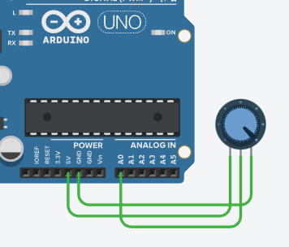

# Mengenal Potensiometer

Potensiometer berfungsi seperti resistor yang bisa diatur besarannya oleh user. Fungsi ini kita bisa gunakan sebagai media input. 

Input dari potensiometer dibaca lewat `analogRead()`. Nilai yang dihasilkan dari potentiometer ini adalah 0-1023.

Potentiometer memiliki 3 kaki:
1. Terminal 1: untuk dihubungkan ke sumber listrik 5V
2. Wiper: untuk dihubungkan ke GND
3. Terminal 2: untuk dihubungkan ke input pin.

Berikut contoh membaca input menggunakan potentiometer dan menampilkan output lewat _Serial Monitor_. Ketika potentiometer diputar full ke kiri, maka `analogRead()` akan memberikan nilai 0, nilai 1023 jika diputas full ke kanan.

Coba buat rangkaian sesuai diagram berikut:



Kode program:

```
void setup()
{  	pinMode(0,INPUT);
  	Serial.begin(9600);
}

void loop()
{
  int x = analogRead(0);  
  Serial.print("Potentiometer reading = ");
  Serial.println(x);
  delay(1000);
}
```

Ketika dijalankan, coba putar _knob_ potentiometer, kemudian lihat outputnya pada _Serial Monitor_