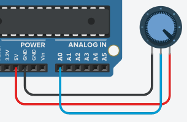

# Mengenal Potensiometer

Potensiometer berfungsi seperti resistor yang bisa diatur besarannya oleh user. Fungsi ini kita bisa gunakan sebagai media input. Coba buat rangkaian sesuai diagram berikut:



```
void setup()
{  	pinMode(0,INPUT);
  	Serial.begin(9600);
}

void loop()
{
  int x = analogRead(0);  
  Serial.print("Potentiometer reading = ");
  Serial.println(x);
  delay(1000);
}
```