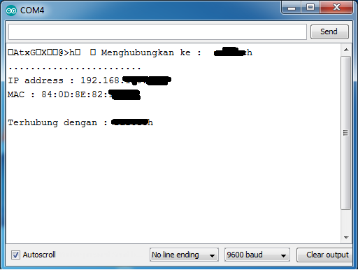

# Wifi

Berikut contoh program menggunakan fitur Wifi pada ESP8266/NodeMCU

# Scan Wifi
Berikut contoh program untuk scan wifi dalam jangkauan perangkat.

```cpp
#include <ESP8266WiFi.h>

void setup() {
  Serial.begin(9600);
  Serial.println(F("\nESP8266 WiFi scan example"));

  // Set WiFi to station mode
  WiFi.mode(WIFI_STA);

  // Disconnect from an AP if it was previously connected
  WiFi.disconnect();
  delay(100);
}

void loop() {
  String ssid;
  int32_t rssi;
  uint8_t encryptionType;
  uint8_t* bssid;
  int32_t channel;
  bool hidden;
  int scanResult;

  Serial.println(F("Starting WiFi scan..."));

  scanResult = WiFi.scanNetworks(/*async=*/false, /*hidden=*/true);

  if (scanResult == 0) {
    Serial.println(F("No networks found"));
  } else if (scanResult > 0) {
    Serial.printf(PSTR("%d networks found:\n"), scanResult);

    // Print unsorted scan results
    for (int8_t i = 0; i < scanResult; i++) {
      WiFi.getNetworkInfo(i, ssid, encryptionType, rssi, bssid, channel, hidden);

      Serial.printf(PSTR("  %02d: [CH %02d] [%02X:%02X:%02X:%02X:%02X:%02X] %ddBm %c %c %s\n"),
                    i,
                    channel,
                    bssid[0], bssid[1], bssid[2],
                    bssid[3], bssid[4], bssid[5],
                    rssi,
                    (encryptionType == ENC_TYPE_NONE) ? ' ' : '*',
                    hidden ? 'H' : 'V',
                    ssid.c_str());
      delay(0);
    }
  } else {
    Serial.printf(PSTR("WiFi scan error %d"), scanResult);
  }

  // Wait a bit before scanning again
  delay(5000);
}

```

# Tes koneksi
Program berikut untuk mengecek konektifitas dengan Wifi

```cpp
#include <ESP8266WiFi.h>

const char *ssid = "**********"; //ganti nama wifi
const char *pass = "**********"; //ganti password

WiFiClient client;

void setup() {
    Serial.begin(9600);
    delay(10);

    Serial.print(" Menghubungkan ke : ");
    Serial.println(ssid);

    WiFi.begin(ssid, pass);
    while (WiFi.status() != WL_CONNECTED) {
        delay(500);
        Serial.print("....");
    }
    Serial.print("\n");
    Serial.print("IP address : ");
    Serial.print(WiFi.localIP());
    Serial.print("\n");
    Serial.print("MAC : ");
    Serial.println(WiFi.macAddress());
    Serial.println("");
    Serial.print("Terhubung dengan : ");
    Serial.println(ssid);
}

void loop() { }
```

Jika rangkaian bisa terhubung dengan Wifi, maka akan informasi nomor IP akan muncul pada _Serial Monitor_.



**Referensi:**
- [Cara Menghubungkan NodeMCU dengan Wifi Internet](http://indomaker.com/product/blog/cara-menghubungkan-nodemcu-dengan-wifi-internet/)